### 一、单周期CPU概述

### 1、它是什么

中央处理器（CPU），是电子计算机的主要设备之一，电脑中的核心配件。其功能主要是解释计算机指令以及处理计算机软件中的数据。CPU是计算机中负责读取指令，对指令译码并执行指令的核心部件。中央处理器主要包括两个部分，即控制器、运算器，其中还包括高速缓冲存储器及实现它们之间联系的数据、控制的总线。电子计算机三大核心部件就是CPU、内部存储器、输入/输出设备。

### 2、它的作用

CPU的功效主要为处理指令、执行操作、控制时间、处理数据。

这四种功能和数据息息相关，从CPU运行的角度来看，CPU不停的取出数据，计算数据，写回数据。

在计算机体系结构中，CPU 是对计算机的所有硬件资源（如存储器、输入输出单元） 进行控制调配、执行通用运算的核心硬件单元。CPU 是计算机的运算和控制核心。计算机系统中所有软件层的操作，最终都将通过指令集映射为CPU的操作。

CPU的结构和其支持指令集相对应，可以说一套指令集对应其特有的CPU结构，一种CPU结构一般只能支持对应指令集。这一点也就是CPU设计的”大纲“。

单周期CPU就是任一指令都可以在一个时钟周期内完成的CPU。

### 3、如何搭建它

CPU需要支持指令集，也就是能执行指令集中所有指令，因此搭建CPU是依托一定计算机体系结构，在数据通路中增加硬件迭代完成。这里说的体系结构，是指冯诺依曼机。

冯诺依曼机的特点有：

(1)计算机处理的数据和指令一律用二进制数表示

(2)顺序执行程序

计算机运行过程中，把要执行的程序和处理的数据首先存入主存储器（内存），计算机执行程序时，将自动地并按顺序从主存储器中取出指令一条一条地执行，这一概念称作顺序执行程序。

(3)计算机硬件由运算器、控制器、存储器、输入设备和输出设备五大部分组成。

### 二、CPU搭建的方法

### 0、CPU基础结构

指令在CPU上执行一般有五个阶段，这五个阶段也对应了CPU逻辑上的五个模块。

取指令：从存储器中取出指令的二进制码。

指令译码：将二进制码译码，获取其中蕴含信息来控制硬件或者取出寄存器中数据。

指令执行：CPU对数据进行运算，得出结果。

存储器访问：从存储器中取出数据，或将数据写入存储器。

结果写回：将数据写回寄存器。

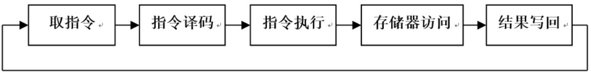

### 1、指令集的分类

CPU的结构和指令集对应，但是指令集指令一般很多，将其分类可以降低CPU设计的工作量。分类是将经过硬件相同（即所需数据通路相同）的指令归为一类，这样可以简化数据通路和控制器的设计。

### 2、找出功能硬件

根据CPU基础结构列出所需硬件，再依据指令来增加硬件。

#### 2.1 基础结构 

首先按照CPU基础的五个阶段列出硬件。

*取指令阶段：*

PC：指令计数器，记录指令在存储器上的地址。

IM：指令存储器，存储指令。

ADD4：自增4模块，用于给指令地址加4成为下一条指令地址，以便跳到下一条指令。

*指令译码阶段：*

RF：寄存器堆，有32个通用寄存器。

*指令执行阶段：*

ALU：算术逻辑单元，对数据进行运算。

*存储器访问阶段：*

DM：数据存储器，存储数据。

*写回阶段：*

RF：寄存器堆，有32个通用寄存器。

#### 2.2 迭代扩展

然后根据指令集来迭代增加硬件，这里以lw指令、ori指令、beq指令为例子扩展功能硬件。

**注：依据指令集扩展的硬件并修改的相应数据通路，在只要求正确性的前提下，是可以有很多设计方案的，他们会各有差异，但都功能正确。以下方案是为了展示设计过程而给出的，不必拘泥于此，能保证功能且尽量保持简单的设计都可行。下文中也会提到设计的多样性。**

**lw指令**

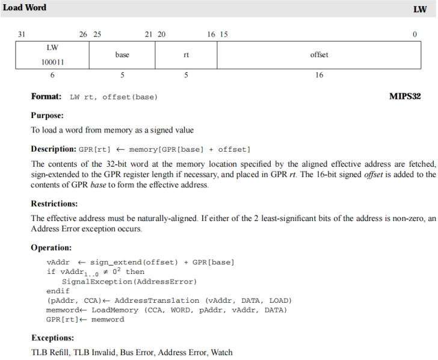

以lw $b, x($a)为例：a是指令码的[25:21]字段，即rs字段；b是指令码的[20:16]字段，即rt字段；x是指令码的低16位，即I16字段（16位立即数字段）。

| 阶段           | 任务                                                         |
| -------------- | ------------------------------------------------------------ |
| 取指令阶段     | lw执行完之后顺序执行下一条指令即可。无需新增硬件单元。       |
| 指令译码阶段   | 从指令码中选出rs，rt，I16字段（即译出a，b，x），再从RF中取出编号为a的寄存器数据，以及将x作符号扩展。因此需要添加位扩展单元用来对x做符号扩展。 |
| 指令执行阶段   | 需要将x扩展得到的字和a号寄存器的数据在ALU中相加得到将要读取的数据地址addr。给ALU赋予加法功能就足以承担，无需新增硬件单元。 |
| 存储器访问阶段 | 将DM中地址为addr的数据data取出。无需新增硬件单元。           |
| 写回阶段       | 将data写回b号寄存器。无需新增硬件单元。                      |

**ori指令**

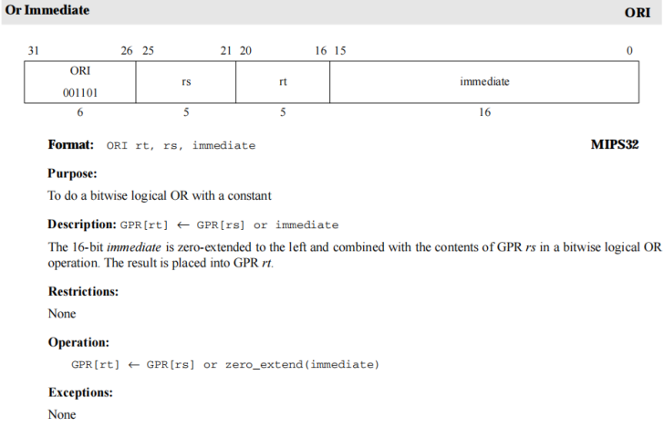

以ori $b, $a, x为例，a是指令码的[25:21]，即rs字段，b是指令码的[20:16]，即rt字段，x是16位立即数字段。

| 阶段           | 任务                                                         |
| -------------- | ------------------------------------------------------------ |
| 取指令阶段     | 顺序执行无跳转，无需新增硬件单元。                           |
| 指令译码阶段   | 译码得到a，b，x（同上），从RF中取出a号寄存器的数据，将x作无符号扩展处理。这里只需要给扩展单元增加功能，无需新增硬件单元。 |
| 指令执行阶段   | 将a和扩展后的x作按位或运算得到结果AO（ALU OUTPUT）。只需要再ALU上增加新的功能，无需新增硬件单元。 |
| 存储器访问阶段 | 无需DM参与。无需新增硬件单元。                               |
| 写回阶段       | 将AO写回b号寄存器。无需新增硬件单元。                        |

找完ori所需硬件，实际上就找到了大部分立即数计算指令所需硬件，比如：addiu，andi，xori，nori等，区别在于**ALU的功能和立即数符号扩展类型**。

**beq指令**

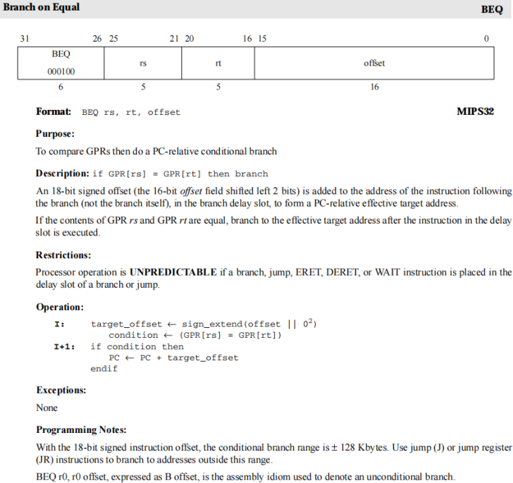

以beq $a，$b，offset为例，a是rs字段，b是rt字段，offset是立即数字段。

| 阶段           | 任务                                                         |
| -------------- | ------------------------------------------------------------ |
| 取指令阶段     | 可能顺序执行，也可能分支执行。因此需要增加选择下一条指令地址和跳转地址的多选器。 |
| 指令译码阶段   | 译码得到a，b，offset（同上），从RF中取出a号和b号寄存器的数据，将offset先左移两位再作符号扩展处理（相对寻址方式），再同PC4（自增4后的指令地址）相加得到BPC。这里需要给扩展单元增加功能，还需新增跳转地址计算单元（NPC）。 |
| 指令执行阶段   | 将a和b相减得到res信号，res=((a-b)==0)。只需要再ALU上增加新的功能，无需新增硬件单元。 |
| 存储器访问阶段 | 无需DM参与。无需新增硬件单元。                               |
| 写回阶段       | 无需写回。                                                   |

这里的设计就有不同方案，比如取指令阶段的多选器就可以不要，而是把PC4直接作为NPC的可能输出（实质上就是将多选器放在NPC内部），直接将NPC的输出作为下一条指令地址。

在我们找出beq的所需硬件时，实际上就找出了大部分分支指令的所需硬件，比如bne、blez、bltz、bgez、bgtz等，区别在于需要修改ALU使其能支持这些指令所需信号。

其余结构根据指令迭代添加。

### 3、构建数据通路

数据通路的构建也就是将所有指令都执行一次的过程，主要可以分为两步：连线、增加多选器。

#### 3.1 硬件连接

上面我们在寻找功能硬件的过程中，实际上已经把所有指令在脑中的CPU执行了一遍，现在要做的就是回顾指令的执行过程，随着指令的执行，连接这些功能硬件。

在连接的过程中也注意**模块化**设计，先连接下层模块的电路以组成上层模块，再将上层模块进行连接组成CPU。

#### 3.2 增加多选器

在连接的过程中，一般会遇到多条线路连接到一个端口，比如：

ALU的B/A端口，即ALU的其中一个操作数来源可以是寄存器中数据（addu），也可以是扩展后的立即数（ori）；RF的A3端口，即要写回寄存器的编号来源可以是指令码的rt字段（lw），也可以是指令码的rd字段（addu），甚至可能是常数（jal）；RF的WD3端口，即要写回寄存器的内容可以是ALU计算结果（add），也可以是DM中取出的数据（lw）。

看起来多选器的增加很麻烦，但实际上是你在遍历执行指令的过程中会自然而然考虑添加的。

#### 3.3 再谈模块化

你可能会感觉，这样又要连接下层模块，又要连接顶层模块，不是徒增烦恼吗？直接连接不好吗？

确实，在指令不多的时候，模块化确实显得很“多余”，但模块化的优势——良好扩展性，在增加指令时能得到鲜明的体现。因为模块化通过**分层**的思想，大大降低了每层的设计难度和连接难度，也更加利于debug。

### 4、控制器的设计

我们上面已经完成了搭建CPU的一部分：数据通路和功能硬件。现在我们来完成控制器的设计。

#### 4.1 why控制器

前面考虑硬件的时候，我们忽略了控制信号，控制信号对CPU的正常运行至关重要：最简单的例子，ALU执行的操作就需要控制信号来控制；其他的还有多选器的选择信号，扩展单元控制信号等等。控制信号就由控制器产生，控制器就是一个逻辑电路，其真值表就是指令以及部分运算结果到控制信号的映射。

#### 4.2 如何设计

控制器的设计很简单，只需要列出真值表，再依据此画出逻辑电路。指令码和控制信号之间的映射双射到真值表，真值表双射到控制器的逻辑电路。

这里的真值表的输入为指令码，在遍历指令时，按照类别的顺序遍历，遍历时写出该指令所需要的所有控制信号。

在列完真值表后开始着手构造控制器，为了简化逻辑电路，采取两个策略：其一，采取二级译码；其二，构建逻辑电路时，与或门电路，与门得到指令，或门得到控制信号。

##### 4.2.1 二级译码

二级译码是指将ALU的控制器独立成模块，主控制器处理其他控制信号，主控制器和ALU控制器共同组成控制器。

二级译码存在的原因是因为R型指令的[31:26]，即op字段为000000，它们的ALU的控制信号需要funct以及其他可能字段决定，但是其余大部分指令的ALU控制信号可仅通过op字段决定。采用二级译码，大部分指令的控制信号的原像只需要op字段，仅当op为000000时，指令的（ALU）控制信号需要额外的字段决定。

二级译码的具体实现：设一中间信号aluctrl，当它为特定值时，ALU控制信号由funct再次译码决定，否则aluctrl就是ALU控制信号。主控制器的输出信号之一为aluctrl，该信号作为ALU控制器的输入产生最终的ALU控制信号aluop。

##### 4.2.2 与或门

与或门设计逻辑电路的思路更加清晰，本质是在分层：先通过op字段判断指令（类别），再通过指令来决定控制信号。本质上与或门就是“书写”最小项表达式。

与门决定指令

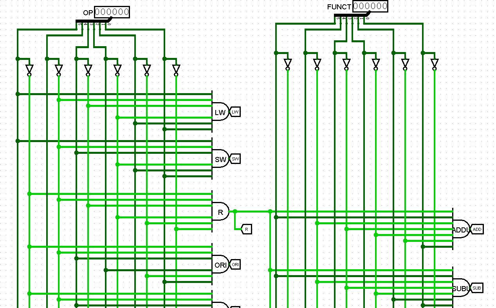

或门决定控制信号

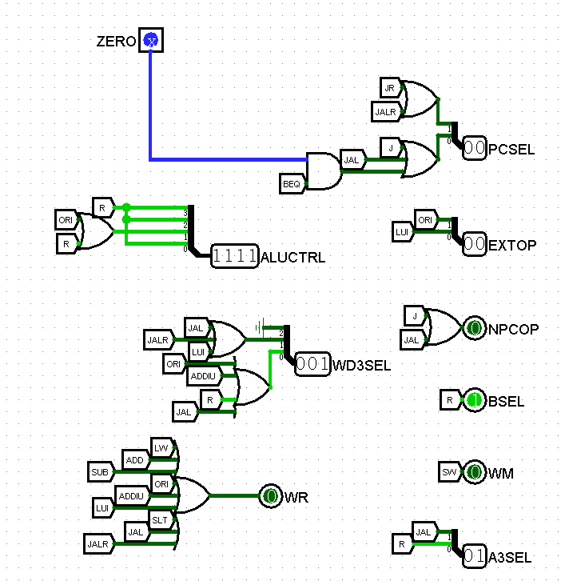

### 三、单周期CPU的搭建（参考）

下面只是一个CPU搭建的例子，作为上面方法的样例，实验涉及到的CPU搭建不需要严格按照此搭建。

### 1、支持指令（指令集）

| str  | ld   | cal_r | cal_i | lui  | b_type | j    | jr   | jal  | jalr | shamt |
| ---- | ---- | ----- | ----- | ---- | ------ | ---- | ---- | ---- | ---- | ----- |
| sw   | lw   | addu  | ori   |      | beq    |      |      |      |      | sll   |
|      |      | subu  | slti  |      |        |      |      |      |      | sra   |
|      |      | slt   | addiu |      |        |      |      |      |      | srl   |
|      |      | sllv  |       |      |        |      |      |      |      |       |
|      |      | srav  |       |      |        |      |      |      |      |       |
|      |      | srlv  |       |      |        |      |      |      |      |       |

### 2、功能模块

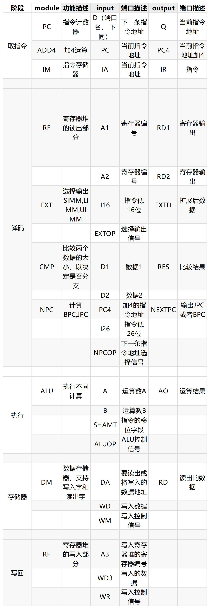

注：上表的SIMM表示将16位立即数作符号扩展成32位；UIMM则是无符号扩展；LIMM则是专门为lui指令设计的将低16位移至高16位，并扩展至32位。BPC则是将指令地址（PC）按照分支指令地址变换方式计算分支地址，JPC则是将指令地址（PC）按照跳转指令地址变换方式计算跳转地址。

### 3、数据通路

下表描述了所有指令对应的硬件连接情况，例如：对LD型指令，ADD4模块的PC端口接PC模块的Q输出，IM模块的IA端口连接PC的Q输出......

连接时注意**分层和模块化**。

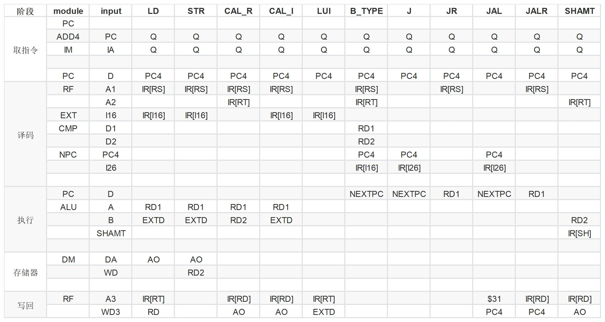

之后，将数据通路进行整合，就是CPU除去控制器的主要通路了。这个过程中也会得到多选器的位置和结构。

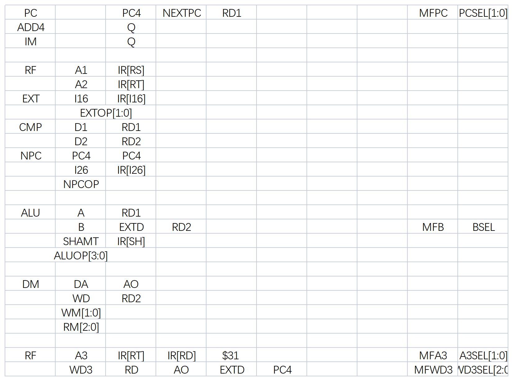

### 4、控制信号

这里的控制信号有很强的**主观性**，某一个信号值代表的意义是什么并没有严格的规定，只要功能正确，任何规定都是合理的。下面只是其中一种仅仅保证功能的规定。

真值表：

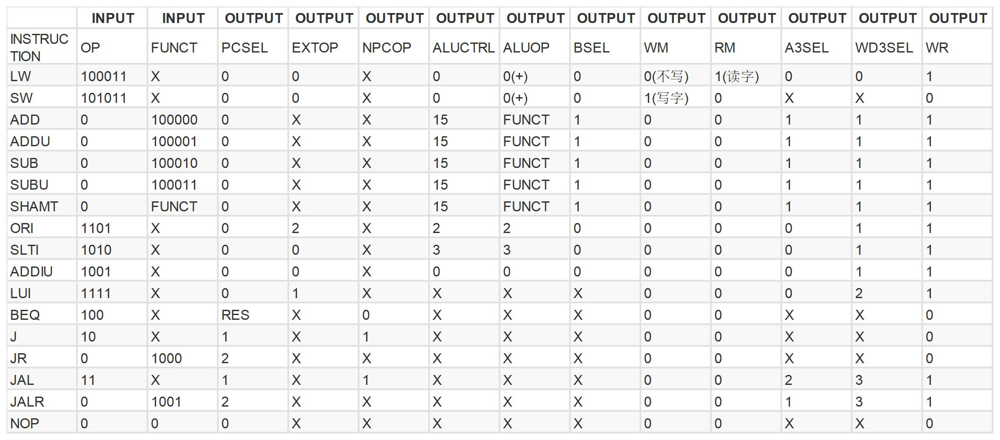

再根据真值表列出（每一位）控制信号的逻辑表达式。（最小项法或最大项法）

最后构造逻辑电路，连线。

### 5、好的范例

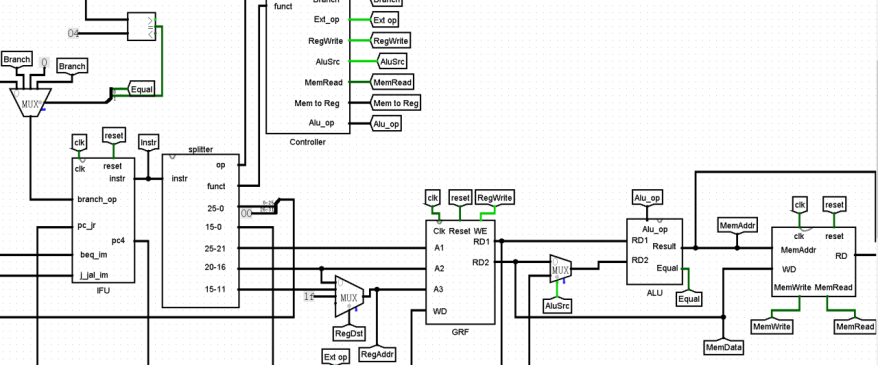

上图搭建的CPU可以明显的看出单周期CPU的五个功能模块加一个控制单元。仅供参考，正确就好。

### 四、实验相关

### 1、实验要求

使用logism自主搭建出一个支持所给指令集的32位CPU，并通过课下正确性测试。同学们可以思考**32位CPU**代表了什么。

课上会通过新增指令的方式当场修改CPU，来考核课下设计的CPU。

- 指令集：

  lw,sw,addu,subu,ori,j,beq。

- 内存大小、指令容量

  内存32字，要求能执行32条指令。**注意：只需要一个ROM和一个RAM，定义好规格就行。**

- 需要在适当的地方添加输出信号以便评测，具体参见提交规格。

### 2、提供硬件

为减小工作量，我们给出部分重要模块和其硬件说明，无需自行设计。

- 寄存器堆：GRF.circ

  

  0号寄存器值一直是0，其他寄存器初始值是0。

  | 端口  | 方向 | 作用                           |
  | ----- | ---- | ------------------------------ |
  | A1    | I    | 输入将要读取的第一个寄存器编号 |
  | A2    | I    | 输入将要读取的第二个寄存器编号 |
  | A3    | I    | 输入将要写入的寄存器编号       |
  | RD1   | O    | 输出A1对应编号寄存器的数据     |
  | RD2   | O    | 输出A2对应编号寄存器的数据     |
  | WD3   | I    | 输入将要写乳寄存器的数据       |
  | CLK   | I    | 时钟信号                       |
  | WE    | I    | 写入使能信号                   |
  | RESET | I    | 复位信号（同步或异步）         |

  

  

  

  [GRF.zip](https://judge.buaa.edu.cn/cguserFiles?filename=0cffd62244676cd38cfebc6dfc23a545.zip&encname=hURotpjKo4c)

**注意将提供模块电路复制到自己的GRF电路中。导入方式如下：**

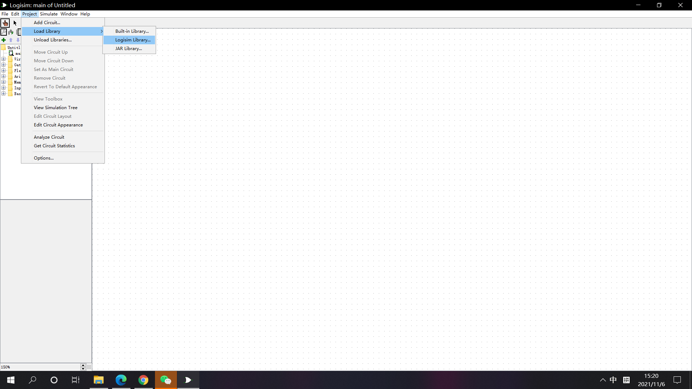

- 数据存储器：DM（使用logism的RAM选用“separate load and store”）

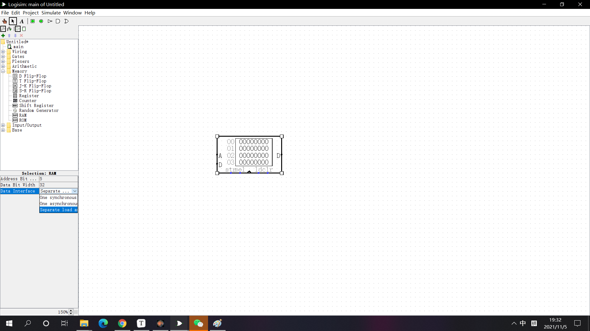

- 指令存储器：选用logism自带的ROM，大小符合需求。

  

  

  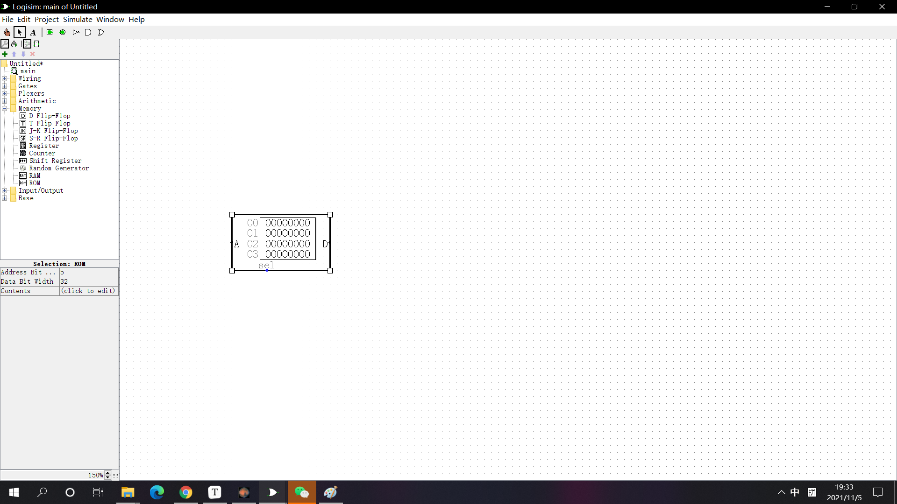

### 3、测试相关

测试可以有效的排除bug，希望同学们能在完成后进行充分的测试。

参考测试策略：先逐条测试指令，验证其正确性，再连续执行指令，检验最终结果。

验证正确性可**借助Mars**来检验自己CPU指令的运行结果和相应寄存器和地址上的数据是否合理。

使用Mars测试时建议采取下述两种方式的任意一种观察：

- 每一条跳转或者分支指令后面加nop指令

- 关闭Mars的延迟槽，详情见下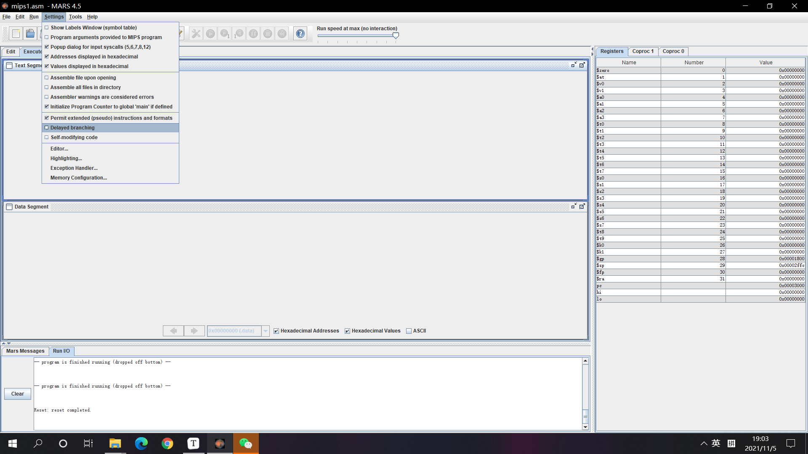

  

### 4、参考资料

对指导书未涉及到的知识，可参考《数字设计和计算机体系结构》第7章的7.3节